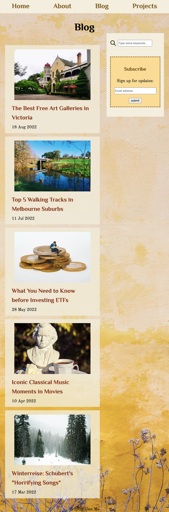
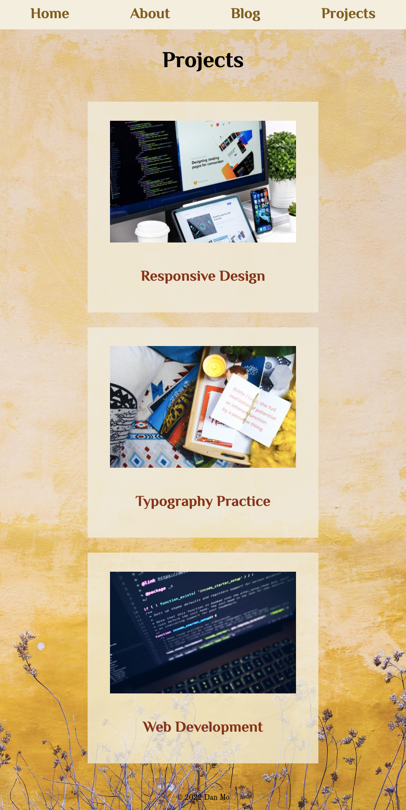

# [Published Portfolio Website](https://effulgent-salamander-4ef5ab.netlify.app/)

# [GitHub Repo](https://github.com/Dandandan-mo/T1A2-Portfolio)

# Descrpition of Portfolio Website

## Purpose

The Purpose of this portfolio website is to introduce my background and personality, and to showcase my professional knowledge and capabilities as a web developer. 

## Functionality and Features

The website's text and graphic contents are wrapped in HTML semantic elements and styled with CSS code, which made the website accessible and appropriate for audience. The website has a responsive design and desplays all componens on devices with different widths (mobile, tablet, and desktop). The website consists of four main pages:
- Home page: contains my profile photo, contact details, and links to my professional accounts in Github, LinkedIn and Facebook. 
- About page: gives a brief introduction about my work experience, education history, and interest. At the bottom of the page there is a link to my Resume. 
- Blog page: lists five blog posts in form of cards. The cards are links to blog post pages. Details of the blog posts could be viewed at the click of the cards. The page also includes a sidebar made of two components: a search bar and a subscription form. 
- Projects page: list projects that showcase my professional skills and capabilities. Projects are also listed in cards which redirect to project repositories on GitHub. 

## Sitemap

## Screenshots
- Home Page

- About Page

- Blog

- Blog Post

- Projects

## Target Audience

Target Audience of this website is potential employer within the IT industry that are looking for commited IT professionals with profound knowledge in coding and web development. 

## Tech Stack
- wireframe: Figma
- sitemap: draw.oi
- website: HTML5, CSS3
- deployment: Netify

